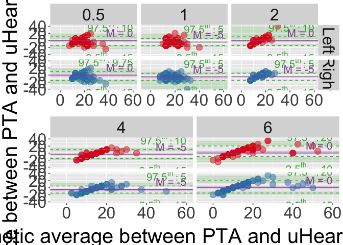

Untitled
================

This repository contains the code accompanying the publication “Do
uHear? Validation of uHear App for Preliminary Screening of Hearing
Ability in Soundscape Studies”. This paper is hosted on [arXiv]() and
the raw dataset is hosted at
[10.21979/N9/0NE37R](https://doi.org/10.21979/N9/0NE37R).

## Environment

The code has been tested on the following platform.

**R version 4.1.1 (2021-08-10)**

**Platform:** x86_64-w64-mingw32/x64 (64-bit)

**locale:** *LC_COLLATE=English_Singapore.1252*,
*LC_CTYPE=English_Singapore.1252*, *LC_MONETARY=English_Singapore.1252*,
*LC_NUMERIC=C* and *LC_TIME=English_Singapore.1252*

**attached base packages:** *grid*, *stats*, *graphics*, *grDevices*,
*utils*, *datasets*, *methods* and *base*

**other attached packages:** *gridExtra(v.2.3)*,
*RColorBrewer(v.1.1-2)*, *ggplot2(v.3.3.5)*, *rstatix(v.0.7.0)*,
*janitor(v.2.1.0)*, *skimr(v.2.1.4)*, *forcats(v.0.5.1)*,
*stringr(v.1.4.0)*, *dplyr(v.1.0.7)*, *plyr(v.1.8.6)*, *tidyr(v.1.1.4)*,
*readxl(v.1.3.1)*, *tibble(v.3.1.4)*, *dataverse(v.0.3.11)* and
*pander(v.0.6.4)*

**loaded via a namespace (and not attached):** *tidyselect(v.1.1.1)*,
*xfun(v.0.26)*, *repr(v.1.1.4)*, *purrr(v.0.3.4)*, *haven(v.2.4.3)*,
*carData(v.3.0-4)*, *snakecase(v.0.11.0)*, *colorspace(v.2.0-2)*,
*vctrs(v.0.3.8)*, *generics(v.0.1.2)*, *htmltools(v.0.5.2)*,
*yaml(v.2.2.1)*, *base64enc(v.0.1-3)*, *utf8(v.1.2.2)*,
*rlang(v.0.4.11)*, *pillar(v.1.7.0)*, *withr(v.2.4.3)*,
*foreign(v.0.8-81)*, *glue(v.1.4.2)*, *lifecycle(v.1.0.1)*,
*munsell(v.0.5.0)*, *gtable(v.0.3.0)*, *cellranger(v.1.1.0)*,
*zip(v.2.2.0)*, *evaluate(v.0.14)*, *knitr(v.1.36)*, *rio(v.0.5.27)*,
*fastmap(v.1.1.0)*, *curl(v.4.3.2)*, *fansi(v.0.5.0)*, *broom(v.0.7.9)*,
*Rcpp(v.1.0.7)*, *backports(v.1.2.1)*, *scales(v.1.1.1)*,
*jsonlite(v.1.7.2)*, *abind(v.1.4-5)*, *hms(v.1.1.1)*,
*digest(v.0.6.28)*, *stringi(v.1.7.4)*, *openxlsx(v.4.2.4)*,
*tools(v.4.1.1)*, *magrittr(v.2.0.1)*, *crayon(v.1.5.0)*,
*car(v.3.0-11)*, *pkgconfig(v.2.0.3)*, *ellipsis(v.0.3.2)*,
*data.table(v.1.14.0)*, *lubridate(v.1.8.0)*, *rmarkdown(v.2.11)*,
*R6(v.2.5.1)* and *compiler(v.4.1.1)*

## Data preparation

Load data from excel

``` r
#load data into dataframe
dataset <- tibble::as_tibble(read_excel("Hearing test result.xlsx",skip = 0))


#prepare data in dataframe for analysis
cols2fac <- colnames(dataset)[colnames(dataset)!="Age"]
facOrder <- c(seq(-10,70,5),"NaN") #order factors
cleandata <- dataset %>% 
        filter(complete.cases(.)) %>% #remove incomplete cases
        mutate_at(cols2fac,factor) %>% #convert variable to factor 
        mutate_at(cols2fac[5:15],~fct_relevel(.,facOrder))
```

    ## Warning: Unknown levels in `f`: -10, 40, 50, 55, 60, 65, 70

    ## Warning: Unknown levels in `f`: -10, -5, 40, 45, 50, 55, 60, 65, 70

    ## Warning: Unknown levels in `f`: -10, -5, 45, 55, 60, 65, 70, NaN

    ## Warning: Unknown levels in `f`: -10, -5, 40, 50, 55, 60, 65, 70

    ## Warning: Unknown levels in `f`: -10, -5, 45, 55, 60, 65, 70, NaN

    ## Warning: Unknown levels in `f`: -10, 35, 45, 50, 55, 60, 65, 70

    ## Warning: Unknown levels in `f`: -10, -5, 35, 40, 45, 55, 60, 65, 70, NaN

    ## Warning: Unknown levels in `f`: -10, 45, 50, 55, 60, 65, 70

    ## Warning: Unknown levels in `f`: -10, 50, 60, 65, 70, NaN

    ## Warning: Unknown levels in `f`: 65, 70, NaN

``` r
#tidy data to wide form
widedata <- cleandata %>%
        pivot_wider(names_from=c(Type,Ear),values_from = c("0.125":"8"))
```

## Exploratory analysis

### Demographics

``` r
demo <- cleandata %>% #extract demographics only
        select(c("Participant ID","Gender","Age")) %>%
        distinct(`Participant ID`,.keep_all = TRUE)
skim(demo)
```

|                                                  |      |
|:-------------------------------------------------|:-----|
| Name                                             | demo |
| Number of rows                                   | 163  |
| Number of columns                                | 3    |
| \_\_\_\_\_\_\_\_\_\_\_\_\_\_\_\_\_\_\_\_\_\_\_   |      |
| Column type frequency:                           |      |
| factor                                           | 2    |
| numeric                                          | 1    |
| \_\_\_\_\_\_\_\_\_\_\_\_\_\_\_\_\_\_\_\_\_\_\_\_ |      |
| Group variables                                  | None |

Data summary

**Variable type: factor**

| skim_variable  | n_missing | complete_rate | ordered | n_unique | top_counts                     |
|:---------------|----------:|--------------:|:--------|---------:|:-------------------------------|
| Participant ID |         0 |             1 | FALSE   |      163 | 000: 1, 000: 1, 000: 1, 000: 1 |
| Gender         |         0 |             1 | FALSE   |        2 | F: 91, M: 72                   |

**Variable type: numeric**

| skim_variable | n_missing | complete_rate |  mean |    sd |  p0 | p25 | p50 | p75 | p100 | hist  |
|:--------------|----------:|--------------:|------:|------:|----:|----:|----:|----:|-----:|:------|
| Age           |         0 |             1 | 27.29 | 11.39 |  18 |  21 |  24 |  27 |   75 | ▇▁▁▁▁ |

``` r
get_summary_stats(demo) #summary stats for age
```

    ## # A tibble: 1 x 13
    ##   variable     n   min   max median    q1    q3   iqr   mad  mean    sd    se
    ##   <chr>    <dbl> <dbl> <dbl>  <dbl> <dbl> <dbl> <dbl> <dbl> <dbl> <dbl> <dbl>
    ## 1 Age        163    18    75     24    21    27     6  4.45  27.3  11.4 0.892
    ## # ... with 1 more variable: ci <dbl>

``` r
demo %>% tabyl(Gender) #gender count w perc
```

    ##  Gender  n   percent
    ##       F 91 0.5582822
    ##       M 72 0.4417178

``` r
#generate latex table
```

### Pure tone audiometry summary statistics

Summarize proportions across dB levels for each frequency

``` r
t<-cleandata %>% 
        filter(Type=="Audiometer") %>%
        tabyl(`0.125`,Ear) %>%
        adorn_totals(where = "row") %>%             # add a total row
        adorn_percentages(denominator = "col") %>%  # convert to proportions
        adorn_pct_formatting() %>%                  # convert to percents
        adorn_ns(position = "front") %>%            # display as: "count (percent)"
        adorn_title(                                # adjust titles
        row_name = "125 Hz",
        col_name = "Ear")
```

### Bland-Altman

Bland-Altman plots to visually compare differences between audiometer
and mobile app

UHear - 0.5 kHz - 1 kHz - 2 kHz - 4 kHz - 6 kHz

J. Martin Bland, D. Altman, STATISTICAL METHODS FOR ASSESSING AGREEMENT
BETWEEN TWO METHODS OF CLINICAL MEASUREMENT, Lancet. 327 (1986) 307–310.
<https://doi.org/10.1016/S0140-6736(86)90837-8>.

``` r
uHfreq<-c("0.5","1","2","4","6")
defvar<-c("Participant ID","Gender","Age","Type","Ear")

#compute mean and difference for each frequency across left and right
tidydata<-dataset %>%
        filter(complete.cases(.)) %>% #remove incomplete cases
        select(c(defvar,uHfreq)) %>% #filter non interested freq
        mutate_at(uHfreq,as.numeric) %>% #convert to numeric
        pivot_longer(!defvar, names_to="freq", values_to= "dB") %>% #long format
        pivot_wider(names_from = Type, values_from = "dB") %>% #expand Type
        mutate(diff=Audiometer-uHear,
               ave=rowMeans(select(.,c("Audiometer","uHear")),na.rm=TRUE)) %>%
        group_by(Ear,freq) %>% #find average diff, lower & upper for each ear and freq
        mutate(avediff = mean(diff),
               lower=mean(diff)- 1.96*sd(diff),
               upper=mean(diff)+ 1.96*sd(diff))

geom.text.size=5.5
theme.size=30
geom.point.size=4
set1clr<-brewer.pal(n = 9,"Set1")
dataupto2kHz<-tidydata %>% filter(!(freq=="4"|freq=="6"))
dataupfrom4kHz<-tidydata %>% filter(!(freq=="0.5"|freq=="1"|freq=="2"))

plot1<-ggplot(dataupto2kHz, aes(x = ave, y = diff,color=Ear)) + facet_grid(Ear~freq) +
  geom_point(size=geom.point.size,alpha=0.5) +
  geom_hline(aes(yintercept = avediff),dataupto2kHz, color=set1clr[3]) +
  geom_text(aes(33,avediff,
                label = paste("mean diff =",as.character(round(avediff,2))), 
                vjust = -0.5), color=set1clr[3],size=geom.text.size, 
            check_overlap = T) +
  geom_hline(aes(yintercept = lower),dataupto2kHz, color = set1clr[3], linetype="dashed") +
  geom_text(aes(35,lower,
                label = paste("+1.96 SD =",as.character(round(lower,2))), 
                vjust = 1.5), color=set1clr[3],size=geom.text.size,
            check_overlap = T) +      
  geom_hline(aes(yintercept = upper),dataupto2kHz, color = set1clr[3], linetype="dashed") +
  geom_text(aes(35,upper,
                label = paste("-1.96 SD =",as.character(round(upper,2))), 
                vjust = -0.5), color=set1clr[3],size=geom.text.size,
            check_overlap = T) +
  ylab(" ") + xlab(" ") +
  scale_color_brewer(palette = "Set1") +
  theme(text = element_text(size=theme.size))
plot2<-ggplot(dataupfrom4kHz, aes(x = ave, y = diff,color=Ear)) + facet_grid(Ear~freq) +
  geom_point(size=geom.point.size,alpha=0.5) +
  geom_hline(aes(yintercept = avediff),dataupfrom4kHz, color=set1clr[3]) +
  geom_text(aes(45,avediff,
                label = paste("mean diff =",as.character(round(avediff,2))), 
                vjust = -0.5), color=set1clr[3],size=geom.text.size,
                alpha=0.8, check_overlap = T) +
  geom_hline(aes(yintercept = lower),dataupfrom4kHz, color = set1clr[3], linetype="dashed") +
  geom_text(aes(45,lower,
                label = paste("+1.96 SD =",as.character(round(lower,2))), 
                vjust = 1.5), color=set1clr[3],size=geom.text.size,
                alpha=0.8, check_overlap = T) +      
  geom_hline(aes(yintercept = upper),dataupfrom4kHz, color = set1clr[3], linetype="dashed") +
  geom_text(aes(45,upper,
                label = paste("-1.96 SD =",as.character(round(upper,2))), 
                vjust = -0.5), color=set1clr[3],size=geom.text.size,
                alpha=0.8, check_overlap = T) +
  ylab(" ") + xlab(" ") + 
  scale_color_brewer(palette = "Set1") +
  theme(text = element_text(size=theme.size))
grid.arrange(plot1,plot2,nrow=2,
             left=textGrob("Difference between PTA and uHear (dB HL)", rot = 90, gp = gpar(fontsize = theme.size)),
             bottom=textGrob("Arithmetic average between PTA and uHear (dB HL)", gp = gpar(fontsize = theme.size)))
```

<!-- -->

``` r
g <- arrangeGrob(plot1, plot2, nrow=2,
             left=textGrob("Difference between PTA and uHear (dB HL)", rot = 90, gp = gpar(fontsize = theme.size)),
             bottom=textGrob("Arithmetic average between PTA and uHear (dB HL)", gp = gpar(fontsize = theme.size))) #generates g
ggsave("BAPlot.svg",plot = g, width = 1500, height = 800, units = "px",scale = 5)
ggsave("BAPlot.pdf",plot = g, width = 1500, height = 1200, units = "px",scale = 3.5)
```

## Statistical analysis
